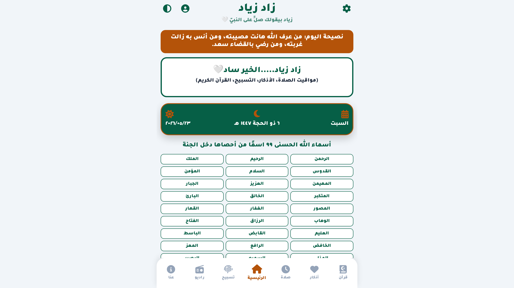

# ☪️ زاد زياد | Zad Ziad

[](LICENSE.md)
[]()
[](https://zad-ziad.vercel.app)

> A Comprehensive Islamic App for Spreading the Remembrance of Allah
> تطبيق إسلامي شامل لنشر ذكر الله



---

## 🌐 English

### Features

- 🕌 **Morning, Evening & Sleep Azkar** — A comprehensive collection of authentic Prophetic Azkar with an interactive counter for each Zekr and completion tracking
- 📿 **Tasbih Counter** — Digital counter with sound effects and vibration, with 18 different Dhikr to choose from
- 📖 **Holy Quran** — Browse the Holy Quran directly within the app
- 🕐 **Prayer Times** — Display prayer times based on location
- 📻 **Quran Radio** — Listen live to the Holy Quran radio
- 🤲 **99 Names of Allah** — Display all the beautiful names of Allah
- 🌙 **Ramadan Countdown** — Countdown to the blessed month of Ramadan
- 💡 **Daily Advice** — Islamic advice that refreshes every 5 minutes
- 🌓 **Dark/Light Mode** — Easy toggle between themes
- 🎨 **7 Color Themes** — Default, Blue, Green, Purple, Pink, Orange, Dark Gray
- 🌐 **Bilingual** — Full Arabic and English support
- 🔔 **Notifications** — Reminder notifications for Azkar times and random Dhikr notifications
- 👤 **Authentication** — Sign in via Google or phone number using Firebase
- ☁️ **Data Sync** — Save and restore data via Firebase Firestore
- 📱 **PWA** — Works as a Progressive Web App

### Technologies

- HTML5, CSS3, JavaScript, Firebase, PWA, Font Awesome, Google Fonts (Tajawal)

### Installation

```bash
git clone https://github.com/ziadamr45/Zad-Ziad.git
cd Zad-Ziad
# Open index.html in your browser directly
# Or use any local server like Live Server
```

### Live Demo

[zad-ziad.vercel.app](https://zad-ziad.vercel.app)

### Contributing

See [CONTRIBUTING.md](CONTRIBUTING.md)

### License

This project uses [Source Available License](LICENSE.md) — © 2026 Ziad Amr

---

## 🇪🇬 العربية

### المميزات

- 🕌 **أذكار الصباح والمساء والنوم** — مجموعة شاملة من الأذكار النبوية الصحيحة مع عداد تفاعلي لكل ذكر وتتبع لحالة الإتمام
- 📿 **عداد التسبيح** — عداد رقمي بتأثيرات صوتية واهتزاز مع 18 ذكراً مختلفاً للاختيار من بينها
- 📖 **القرآن الكريم** — تصفح القرآن الكريم مباشرة من داخل التطبيق
- 🕐 **مواقيت الصلاة** — عرض مواقيت الصلاة حسب الموقع
- 📻 **إذاعة القرآن الكريم** — استماع مباشر لإذاعة القرآن الكريم
- 🤲 **أسماء الله الحسنى ٩٩** — عرض جميع أسماء الله الحسنى
- 🌙 **عداد رمضان** — عداد تنازلي لشهر رمضان المبارك
- 💡 **نصيحة اليوم** — نصائح إسلامية متجددة كل 5 دقائق
- 🌓 **الوضع الليلي/النهاري** — تبديل سهل بين المظهرين
- 🎨 **7 سمات ألوان** — افتراضي، أزرق، أخضر، بنفسجي، وردي، برتقالي، رمادي داكن
- 🌐 **ثنائي اللغة** — دعم كامل للعربية والإنجليزية
- 🔔 **الإشعارات** — إشعارات تذكيرية بمواعيد الأذكار وإشعارات عشوائية للأذكار
- 👤 **تسجيل الدخول** — مصادقة عبر Google أو رقم الهاتف باستخدام Firebase
- ☁️ **مزامنة البيانات** — حفظ واستعادة البيانات عبر Firebase Firestore
- 📱 **PWA** — يعمل كتطبيق ويب تقدمي

### التقنيات

- HTML5، CSS3، JavaScript، Firebase، PWA، Font Awesome، Google Fonts (Tajawal)

### التثبيت

```bash
git clone https://github.com/ziadamr45/Zad-Ziad.git
cd Zad-Ziad
# افتح ملف index.html في المتصفح مباشرة
# أو استخدم أي خادم محلي مثل Live Server
```

### تجربة مباشرة

[zad-ziad.vercel.app](https://zad-ziad.vercel.app)

### المساهمة

راجع [CONTRIBUTING.md](CONTRIBUTING.md)

### الرخصة

هذا المشروع يستخدم [رخصة عرض المصدر](LICENSE.md) — © 2026 زياد عمرو

---

## Developer | المطور

**Ziad Amr** (زياد عمرو)

- 🌐 Portfolio: [ziadamrme.vercel.app](https://ziadamrme.vercel.app)
- 💼 GitHub: [github.com/ziadamr45](https://github.com/ziadamr45)
- 📘 Facebook: [facebook.com/ziad7mr](https://www.facebook.com/ziad7mr)
- 💬 Telegram: [t.me/ziadamr](https://t.me/ziadamr)
- 📸 Instagram: [instagram.com/ziadamr455](https://www.instagram.com/ziadamr455/)
- 🧵 Threads: [threads.com/@ziadamr455](https://www.threads.com/@ziadamr455)
- 🐦 X (Twitter): [x.com/ziad90216](https://x.com/ziad90216)
- 🎥 YouTube: [youtube.com/@alhayat_ala_eltarek](https://youtube.com/@alhayat_ala_eltarek)
- 💼 LinkedIn: [linkedin.com/in/ziad-amr-44633a411](https://www.linkedin.com/in/ziad-amr-44633a411)
- 📧 Email: ziad90216@gmail.com

---
<p align="center">
  Powered by <a href="https://github.com/ziadamr45">Ziad Amr</a>
</p>
